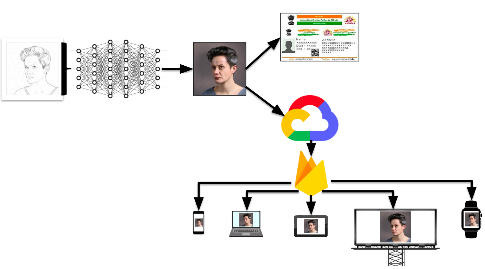

# Suspect Subjugation Using GANs

India is a densely populated country with an increasing crime rate. We aim to help the crime department reduce this rate exponentially.
The criminal suspects can be caught with the help of AI (Artificial Intelligence). In most cases, the crime department has the sketch of the criminal but
it faces issues with the time taken to find the location of the suspected criminal and thus there is a wastage of resources 
in narrowing down the suspect's location. This problem can be solved with the help of the public. 
The sketch submitted to the crime department can be converted to a digital real image of high accuracy using the recently (2014)
introduced state of the art GANs (Generative Adversarial Networks) by Ian Goodfellow. The image-to-image translation technique can be 
widely applied in the domain of criminal suspect subjugation.
 
The project has two parts:
1. Developing GAN model.
2. Developing Web and Mobile App and deploying the GAN model on them.

## Work Flow
<p align="center">
  
</p>
<p align="center">
  
</p>

1. We developed our own stable GAN for this purpose and found a midway solution for trade-off between 
computation power and FID score (accuracy measurement for GANs). 
2. The technology used to convert sketch to realistic image is image-to-image translation using GANs.
3. We developed a platform (mobile as well as web app) that helps the crime department to narrow down the criminal suspect’s 
location and thus eventually capturing him/her.
4. On the crime department’s part, they will be able to convert the sketch to real digital image using the GAN model, upload it on the cloud 
and circulate it on the users (public) part of the platform (mobile app).
5. When the users recognize the suspect around them or have known to see him/her they can report their location or location with time (in second case) in the app. 
6. The crime department receives the locations with the help of Google Maps API and thus a timeline of the suspect’s movements is being submitted live.
7. Therefore, when the public reports their locations on the app, for the crime department this data becomes available in the 
form of timeline/timestamps resulting in narrowing down the suspect’s recent location.
8. Similar approach can be used to narrow down location when someone/something goes missing (dog, cat, cycle, etc.)
9. The real image obtained using GANs can also be compared with the facial image data available with the UIDAI or other government agencies. Once recognized, 
this will help the crime department with basic information of the suspect.
10. Screen-based IoT(Internet of Things) devices prove to be beneficial while broadcasting the image to gain more public attention.
11. The problem of fake location submitted by the criminals can be tackled using the density estimation of the available 
data within a specified duration of time ‘t’ (example: t = 60s).
12. Also, the GAN converted image can be sent to intelligent traffic system cameras installed in every square and
using facial recognition, the suspect can be tracked. 


## Getting Started (For web app)
Before cloning this repository, make sure to do the following:

1. Make a new directory
2. Create a venv to work with
3. Activate the venv and install Node.js
4. Clone this repo and get started... 

After cloning the repo:

1. Run the command `npm install` to install all the dependencies and devDependencies (`node_modules`) mentioned in the `package.json` file 
2. Install nodemon globally using `npm install -g nodemon` and then run `nodemon src/app.js` to start the web app. 
3. Alternatively, you can use nodemon as devDependency and run it locally.
4. You can also use `node src/app.js` to run using node.

### Project Structure (Web app)
```
my-web-app # (dir for holding project components)
---- venv
---- node_modules
---- public
-------- css
-------- img
-------- js
---- src
-------- controllers
-------- db
-------- models
-------- routers
-------- app.js (starting point of the app)
---- templates
-------- views
------------ *.ejs
------------ partials
---------------- *.ejs (headers and footers)
---- .gitignore
---- .env
---- package-lock.json
---- package.json
---- README.md
```


## In Progress
1. Deploying ML model on the web app developed
2. Changing the current GAN model to WGAN (Wasserstein GAN)  
3. (7)-(11) from Work Flow
